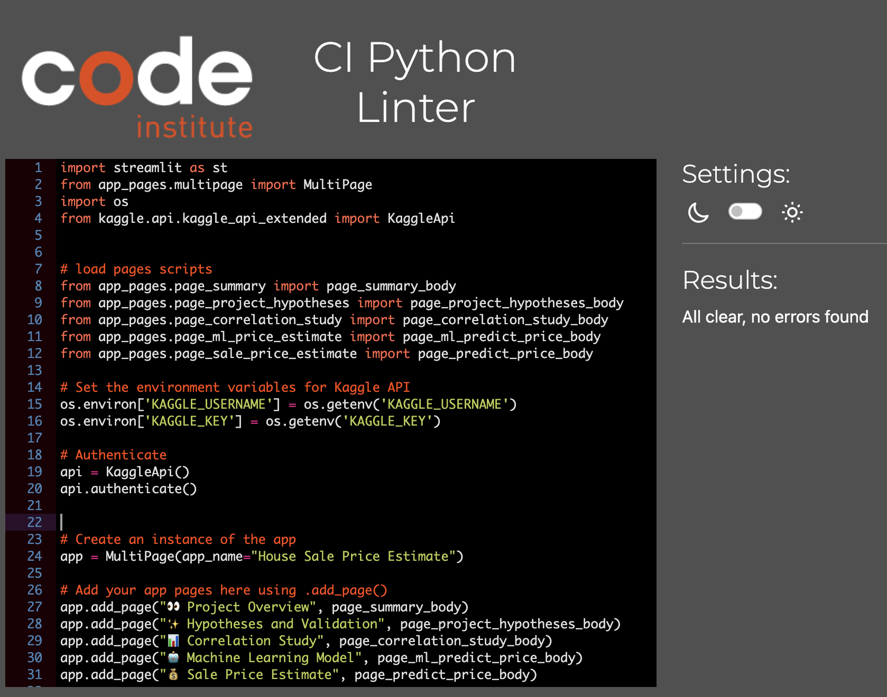
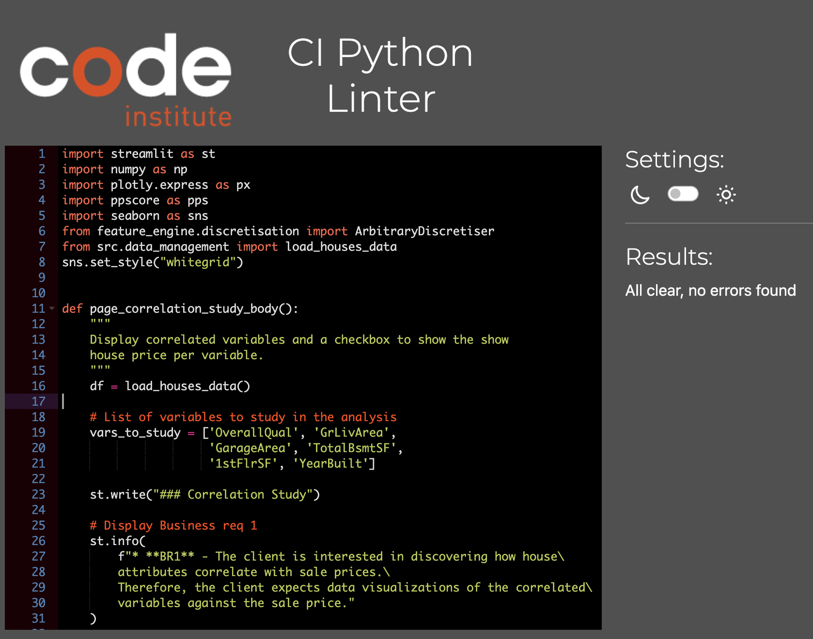
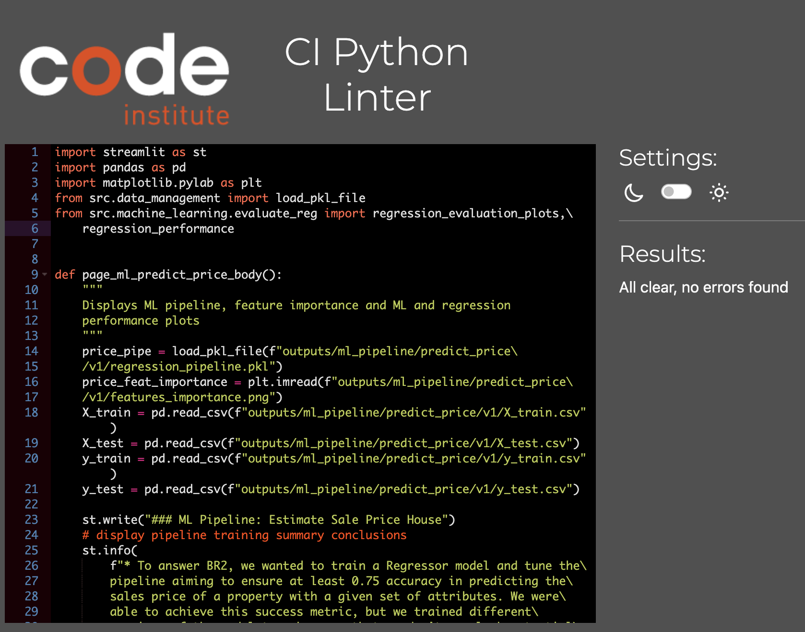
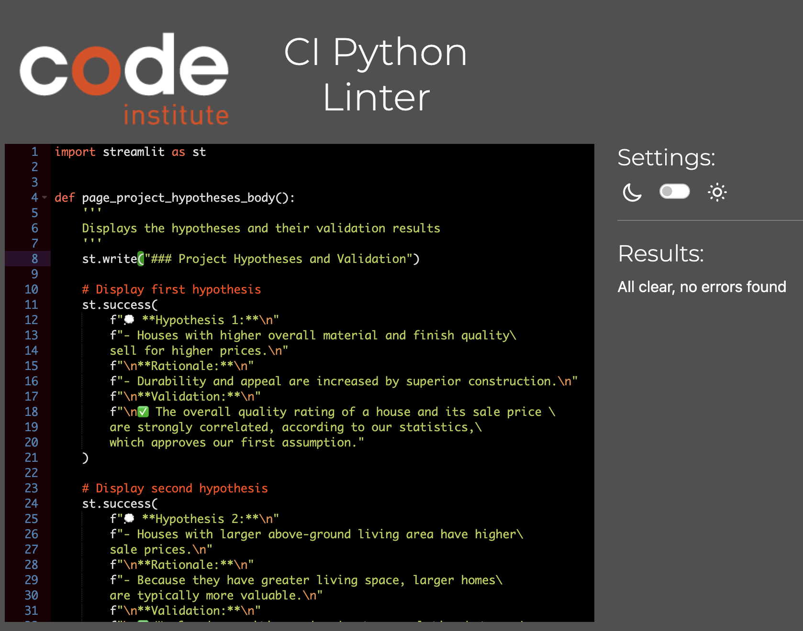
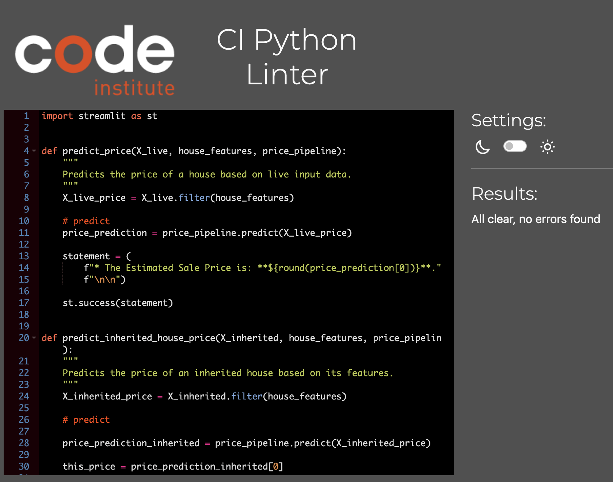
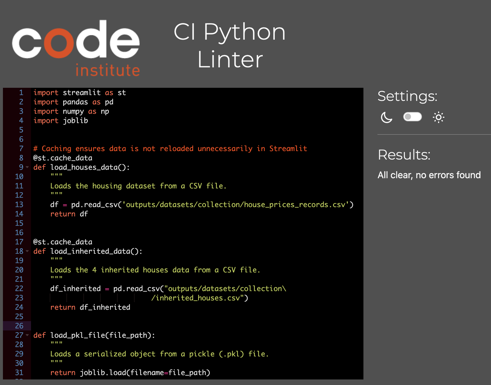

# House Sale Price Estimate

Welcome to the **House Sale Price Estimate**!

The goal of this project is to use **regression algorithms** and **machine learning** to precisely forecast Ames, Iowa home prices. Before selling, our customer wants to increase the **market value** of the four houses she inherited. Our goal is to give **data-driven insights** that result in the best pricing strategies by examining important housing characteristics and developing a strong predictive model.

The project is accessible on [Render](https://sales-house-price-estimate.onrender.com/)

# Table of Contents

- [House Sale Price Estimate](#house-sale-price-estimate)
- [Table of Contents](#table-of-contents)
  - [Dataset Content](#dataset-content)
  - [Terminology](#terminology)
  - [Business Requirements](#business-requirements)
  - [Agile Methodology](#agile-methodology)
    - [Epics](#epics)
    - [User Stories](#user-stories)
  - [Hypothesis and how to validate?](#hypothesis-and-how-to-validate)
  - [The rationale to map the business requirements to the Data Visualisations and ML tasks](#the-rationale-to-map-the-business-requirements-to-the-data-visualisations-and-ml-tasks)
  - [ML Business Case](#ml-business-case)
  - [Cross-industry standard process for data mining](#cross-industry-standard-process-for-data-mining)
  - [Data Preprocessing](#data-preprocessing)
    - [Data Cleaning Pipeline](#data-cleaning-pipeline)
    - [Feature Engineering](#feature-engineering)
      - [Categorical encoding](#categorical-encoding)
      - [Numerical Transformations](#numerical-transformations)
  - [Dashboard Design](#dashboard-design)
    - [Streamlit sidebar](#streamlit-sidebar)
    - [Summary page](#summary-page)
    - [Hypotheses and Validation page](#hypotheses-and-validation-page)
    - [Correlation Study page](#correlation-study-page)
    - [Machine Learning Model page](#machine-learning-model-page)
    - [Sale Price Estimate page](#sale-price-estimate-page)
    - [Performance and Feature Importance](#performance-and-feature-importance)
  - [Bugs and Fixes](#bugs-and-fixes)
  - [Project Testing](#project-testing)
    - [PEP 8](#pep-8)
  - [Deployment](#deployment)
  - [Technologies](#technologies)
  - [Python Packages](#python-packages)
  - [Credits](#credits)
    - [Code](#code)
    - [Media](#media)
  - [Acknowledgements (optional)](#acknowledgements-optional)

## Dataset Content

* The dataset is sourced from [Kaggle](https://www.kaggle.com/codeinstitute/housing-prices-data). We then created a fictitious user story where predictive analytics can be applied in a real project in the workplace.
* The dataset has 1460 rows and represents housing records from Ames, Iowa, indicating house profile (Floor Area, Basement, Garage, Kitchen, Lot, Porch, Wood Deck, Year Built) and its respective sale price for houses built between 1872 and 2010.

|Variable|Meaning|Units|
|:----|:----|:----|
|1stFlrSF|First Floor square feet|334 - 4692|
|2ndFlrSF|Second-floor square feet|0 - 2065|
|BedroomAbvGr|Bedrooms above grade (does NOT include basement bedrooms)|0 - 8|
|BsmtExposure|Refers to walkout or garden level walls|Gd: Good Exposure; Av: Average Exposure; Mn: Minimum Exposure; No: No Exposure; None: No Basement|
|BsmtFinType1|Rating of basement finished area|GLQ: Good Living Quarters; ALQ: Average Living Quarters; BLQ: Below Average Living Quarters; Rec: Average Rec Room; LwQ: Low Quality; Unf: Unfinshed; None: No Basement|
|BsmtFinSF1|Type 1 finished square feet|0 - 5644|
|BsmtUnfSF|Unfinished square feet of basement area|0 - 2336|
|TotalBsmtSF|Total square feet of basement area|0 - 6110|
|GarageArea|Size of garage in square feet|0 - 1418|
|GarageFinish|Interior finish of the garage|Fin: Finished; RFn: Rough Finished; Unf: Unfinished; None: No Garage|
|GarageYrBlt|Year garage was built|1900 - 2010|
|GrLivArea|Above grade (ground) living area square feet|334 - 5642|
|KitchenQual|Kitchen quality|Ex: Excellent; Gd: Good; TA: Typical/Average; Fa: Fair; Po: Poor|
|LotArea| Lot size in square feet|1300 - 215245|
|LotFrontage| Linear feet of street connected to property|21 - 313|
|MasVnrArea|Masonry veneer area in square feet|0 - 1600|
|EnclosedPorch|Enclosed porch area in square feet|0 - 286|
|OpenPorchSF|Open porch area in square feet|0 - 547|
|OverallCond|Rates the overall condition of the house|10: Very Excellent; 9: Excellent; 8: Very Good; 7: Good; 6: Above Average; 5: Average; 4: Below Average; 3: Fair; 2: Poor; 1: Very Poor|
|OverallQual|Rates the overall material and finish of the house|10: Very Excellent; 9: Excellent; 8: Very Good; 7: Good; 6: Above Average; 5: Average; 4: Below Average; 3: Fair; 2: Poor; 1: Very Poor|
|WoodDeckSF|Wood deck area in square feet|0 - 736|
|YearBuilt|Original construction date|1872 - 2010|
|YearRemodAdd|Remodel date (same as construction date if no remodelling or additions)|1950 - 2010|
|SalePrice|Sale Price|34900 - 755000|

## Terminology

**Sale Price** is the current market value of a house, based on its characteristics and features.

**Inherited House** is a property that the client has inherited and requires an assessment of its market value.

**Total Price** is the total of the predicted market prices for all four houses inherited by the client.

## Business Requirements

As a good friend, you are requested by your friend, who has received an inheritance from a deceased great-grandfather located in Ames, Iowa, to  help in maximising the sales price for the inherited properties.

Although your friend has an excellent understanding of property prices in her own state and residential area, she fears that basing her estimates for property worth on her current knowledge might lead to inaccurate appraisals. What makes a house desirable and valuable where she comes from might not be the same in Ames, Iowa. She found a public dataset with house prices for Ames, Iowa, and will provide you with that.

* 1 - The client is interested in discovering how the house attributes correlate with the sale price. Therefore, the client expects data visualisations of the correlated variables against the sale price to show that.

* 2 - The client is interested in predicting the house sale price from her four inherited houses and any other house in Ames, Iowa.

Epics and User Stories have been defined in order to satisfy these business needs. An agile approach to implementation is made possible by the further division of these user stories into smaller, more manageable tasks.

## Agile Methodology

### Epics
- **Data Collection and Information Gathering Epic**
- **Data Visualization, Cleaning, and Preparation Epic**
- **Model Training, Optimization, and Validation Epic**
- **Dashboard Planning, Design, and Development Epic**
- **Dashboard Deployment and Release Epic**

### User Stories

- **Data Collection and Information Gathering Epic**
  - User Story 1.1: Install Required Dependencies and Packages - Business Requirement 1 & 2
    - As a developer, I need to install all required dependencies and packages so that I can effectively utilize the necessary tools for project implementation.
      - Acceptance Criteria:
        - All dependencies are installed successfully without errors.
      - Tasks:
        - Install all required dependencies using the PIP package manager.
      - How they were completed:
        - The command `pip install -r requirements.txt` was typed in the IDE terminal.

  - User Story 1.2: Import Relevant Data into Jupyter Notebook - Business Requirement 1 & 2
    - As a developer, I need to import relevant data into a Jupyter Notebook so that I can conduct a thorough analysis of the dataset.
      - Acceptance Criteria:
        - The housing dataset is successfully downloaded from Kaggle.
        - The dataset is in CSV format and correctly read using Pandas.
      - Tasks:
        - Download the housing dataset from Kaggle using the Kaggle API.
        - Read the CSV files into DataFrames using Pandas.
      - How they were completed:
        - The kaggle.json credentials file was downloaded from kaggle.com and used to authenticate with the API to download the housing dataset.
        - The `pd.read_csv()` function was used to read the CSV files into a DataFrame.

- **Data Visualization, Cleaning, and Preparation Epic**
  - User Story 2.1: Data Cleaning and Quality Assurance - Business Requirement 1
    - As a developer, I want to implement a robust data cleaning process so that I can ensure the dataset is accurate, reliable, and of high quality.
      - Acceptance Criteria:
        - All missing or null values in the dataset must be identified.
        - A data profile report must be generated.
        - Visualizations should demonstrate the effect of cleaning.
        - Missing values are imputed.
      - Tasks:
        - Inspect the dataset to identify missing or null values.
        - A complete data profile report is generated.
        - Create visualizations (bar charts, box plots, histograms).
        - Apply imputation to missing values.
      - How they were completed:
        - The expression `df.isnull()` or `df.isna()` returns missing values.
        - the expression `ProfileReport(df=df, minimal=True)` generates an automated exploratory data analysis (EDA) report.
        - A custom function called `DataCleaningEffect()` visualizes the effects of cleaning.
        - The class instantiations `MeanMedianImputer(imputation_method='mean')` and `MeanMedianImputer(imputation_method='median')` were created, followed by the fit_transform() method.

- **Model Training, Optimization, and Validation Epic**
  - User Story 3.1: Model Performance Evaluation - Business Requirement 2
    - As a developer, I want to evaluate the performance of the predictive model so that I can ensure the reliability and accuracy of its predictions.
      - Acceptance Criteria:
        - The predictive model must be evaluated to ensure reliability and accuracy of its predictions.
      - Tasks:
        - Evaluate the predictive model to ensure reliability and accuracy of its predictions.
      - How they were completed:
        - An R2 score of at least 0.75 on the train set and test set was measured.
  - User Story 3.2: Individual Prediction Testing - Business Requirement 2
    - As a developer, I want to test individual data points against the model’s predictions so that I can determine the target variable based on my provided features.
      - Acceptance Criteria:
        - Individual data points must be tested against the model's predictions to determine the target variable.
      - Tasks:
        - Test individual data points against the model's predictions to determine the target variable.
      - How they were completed:
        - Plots were generated that measure Actual vs Prediction for both train and test sets.

- **Dashboard Planning, Design, and Development Epic**
  - User Story 4.1: Streamlit Landing Page Access - Business Requirement 1 & 2
    - As a client, I want to access the Streamlit landing page so that I can quickly gain an overview of the project.
      - Acceptance Criteria:
        - The client should be able to quickly gain an overview of the project through the Streamlit landing page.
      - Tasks:
        - Create a streamlit landing page that allows the client to quickly gain an overview of the project.
      - How they were completed:
        -  A Streamlit multi-page application with a sidebar was created to allow the client to quickly gain an overview of the project.

  - User Story 4.2: Data Visualization for Insights - Business Requirement 1
    - As a client, I want to view data visualizations that illustrate the relationship between the target variable and its key features so that I can gain deeper insights from the data.
      - Acceptance Criteria:
        - The client should be able to view data visualizations that illustrate the relationship between the target variable.
      - Tasks:
        - Create a streamlit page that shows data visualizations that illustrate the relationship between the target variable and its key features.
      - How they were completed:
        - A correlation analysis streamlit page was created that shows data visualizations that illustrate the relationship between the target variable and its key features.

  - User Story 4.3: Correlation Analysis View - Business Requirement 1
    - As a client, I want to view a correlation analysis page on Streamlit so that I can understand the relationships between various features and the target variable.
      - Acceptance Criteria:
        - The correlation analysis page has to be accessible through the Streamlit sidebar.
        - The page should display visual representation between features and the target variable.
        - The page should allow the client to interact with the heatmap.
      - Tasks:
        - Create a correlation analysis page that is accessible through the Streamlit sidebar.
        - Create a heatmap or visual representation of the correlations between features and the target variable.
        - Create a page that allows the client to interact with the heatmaps.
      - How they were completed:
        - The correlation analysis page was created and made accesible through the Streamlit sidebar by adding its body function `page_correlation_study_body` to `app.py`.

  - User Story 4.4: Key Features for Sale Price Prediction - Business Requirement 1
    - As a client, I want to identify the key attributes of a house that have the strongest correlation with its potential sale price so that I can make data-driven pricing decisions.
      - Acceptance Criteria: 
        - The client should be able to identify the key attributes of a house that have the strongest correlation with its potential sale price.
      - Tasks:
        - Perform pearson and spearman correlation analysis to find the relationship between different features and the sale price.
      - How they were completed:
        - The code `df.corr(method="pearson")` was used to calculate pearson correlation, and `df.corr(method="spearman")` to calculate spearman correlation on the DataFrame.

  - User Story 4.5: Interactive Prediction Input - Business Requirement 2
    - As a client, I want interactive input fields that allow me to enter custom data so that I can generate personalized predictions for the target variable.
      - Acceptance Criteria:
        - The input fields should allow the user to enter values for each feature or variable that influences the prediction.
        - Each input field must have validation to ensure the entered data is in the correct format.
      - Tasks:
        - Create input fields that allow the user to enter values for each feature or variable that influences the prediction.
        - Create input fields with validation to ensure the entered data is in the correct format.
      - How they were completed:
        - Streamlit widgets were created with `st.number_input` to allow the user to enter values for each feature or variable that influences the prediction.
        - Input widgets were given a defined `min_value` and `max_value` to ensure the input is within a realistic range.

  - User Story 4.6: Accurate Sale Price Prediction - Business Requirement 2
    - As a client, I want the most accurate possible prediction of the sale prices for the inherited properties so that I can maximize the financial returns from selling the four houses.
      - Acceptance Criteria:
        - The sale prices of the inherited properties must be accurately predicted.
      - Tasks:
        - Predict the price accurately of the inherited properties.
      - How they were completed:
        - A machine learning regression model was used to accurately predict the price of the inherited properties.

  - User Story 4.7: Predictive Model Dashboard - Business Requirement 2
    - As a developer, I need to create a dashboard to effectively visualize and communicate the results of the model's predictions.
      - Acceptance Criteria:
        - A streamlit dashboard must be created.
        - The dashboard must visualize and communicate the results of the model's predictions.
      - Tasks:
        - Create a streamlit dashboard.
        - Create a dashboard that visualizes and communicates the results of the model's predictions.
      - How they were completed:
        - The Python streamlit library was used to create a dashboard.
        - A dashboard was created that displays the model's predictions through DataFrames and a Sales Price calculator.

- **Dashboard Deployment and Release Epic**

  - User Story 5.1: Early Deployment on Render - Business Requirement 1 & 2
    - As a developer, I want to initiate the deployment process of my application on Render at an early stage so that I can conduct end-to-end manual deployment testing from the outset.
      - Acceptance Criteria:
        - The application must be successfully deployed to Render.
        - Build and start commands must be correctly configured.
        - The environment variables must be configured correctly for deployment.
        - Deployment is automated with auto-deploy.   
      - Tasks:
        - Deploy the application to Render.
        - Define the necessary build and start commands in Render settings.
        - Configure environment variables required for deployment.
        - Enable auto-deploy from the connected repository. 
      - How they were completed:
        - A new Web Service was created on Render.
        - The build command was set to `pip install -r requirements.txt && ./setup.sh` and the start command to `streamlit run app.py`.
        - Environment variables were set to `PORT` `Value: 8501` and `PYTHON_VERSION` `Value: 3.12.1`.
        - Auto-deploy settings were set to Yes.

## Hypothesis and how to validate?

- **First Hypothesis**: Houses with higher overall material and finish quality sell for higher prices.
  - **Rationale**: Durability and appeal are increased by superior construction.
    - **How to validate hypothesis**: We will examine the relationship between house overall material and finish quality attributes and sale price to test this hypothesis.
    - **Hypothesis Confirmation**: The overall quality rating of a house and its sale price are strongly correlated, according to our statistics, which approves our first assumption.

- **Second Hypothesis**: Houses with larger above-ground living area have higher sale prices.
  - **Rationale**: Because they have greater living space, larger homes are typically more valuable.
    - **How to validate hypothesis**: We will examine the correlations between 'GrLivArea' attribute, in order to validate the hypothesis.
    - **Hypothesis Confirmation**: We found a positive and moderate correlation between parameters related to property size and sale price after doing a comprehensive correlation analysis. This supports our original hypothesis by indicating that larger houses typically sell for higher prices.

- **Third Hypothesis**: Houses with extra spaces get to a higher sale price.
  - **Rationale**: Houses with additional features such as garages, or finished basements are more expensive.
    - **How to validate hypothesis**: We will explore the data related to 'GarageArea' and 'TotalBsmtSF' to validate this hypothesis.
    - **Hypothesis Confirmation**: Our analysis confirmed our assumption by revealing a good positive correlation of all that indicates additional features and spaces, like garage area or basement area. These features improve comfort and perceived luxury.

- **Fourth Hypothesis** : Houses with a good kitchen quality have a good impact on the sale price.
  - **Rationale**: A good quality kitchen attracts buyers, as that is the place where majority spend a large amount of time.
    - **How to validate hypothesis**: We will explore the data related to kitchen quality to validate the hypothesis.
    - **Hypothesis Confirmation**: We can maintain our premise that a high-quality kitchen enhances the overall quality of a property even if the variable does not correspond to our top factors. Additionally, this variable had a favorable link with our target, according to our correlation investigation.

## The rationale to map the business requirements to the Data Visualisations and ML tasks

- **Business Requirement 1: Data Visualization & Correlation Analysis**
  - Conduct a correlation study using Pearson and Spearman correlation coefficients to assess the relationship between house attributes and the target variable, house price.
  - Evaluate the significance of these correlations.
  - Visualize key variables against house prices to gain insights into their impact.
  - This analysis is documented in the [Data Cleaning notebook](https://github.com/CristianaDvD/Sales-House-Price-Estimate/blob/main/jupyter_notebooks/03_Data_Cleaning.ipynb)

- **Business Requirement 2: Regression Analysis for Price Prediction**
  - Since house price is a continuous variable, a regression analysis is performed to build a predictive model.
  - If regression models do not meet performance expectations, classification-based approaches may be explored.
  - The goal is to predict house prices using key features: `OverallQual`, `GrLivArea`, `GarageArea`, `TotalBsmtSF`
  - This analysis is detailed in the [Modelling and Evaluation notebook](https://github.com/CristianaDvD/Sales-House-Price-Estimate/blob/main/jupyter_notebooks/05_Modelling_Evaluation_Predict.ipynb)

## ML Business Case

In order to meet the second business requirement (BR2), we want to train a Machine Learning model.

* *The aim behind the Machine Learning model* is to enable our client to predict sale price of four inherited houses as well as any house with similar attributes.

* *The learning method* for the Machine Learning model is a **regression model**, because our target variable is a discrete number. It will be a supervised and uni-dimensional ML task.

* *The ideal outcome* provide our client with reliable insight into house attributes that *help maximize its sale price*.

* *The model success/failure metrics* are
	* At least 0.75 for R2 score, on train and test set
	* The ML model is considered a failure if:
		* for a given house, the model's predictions are off more than 25% of the time.

* The output is defined as a continuous value for sale price in USD. It is assumed that this model will predict sale price of a house whose relevant attributes are known. 
   * *The inherited houses* that our client has provided us *have known attributes*, and we want the model to predict the sale price of each house and the total sale price for the four inherited houses. 
   * For *live prediction* of sale price of a house other than the four inherited houses, we want to enable the user to enter the required values for the relevant features and get the *predicted sale price* in real-time. *The model output* in the live prediction will not include total sale price, because the user will enter data for one house at a time.
   * Both the total sale price and the live prediction *are relevant for our client*, who already has four inherited houses but may also want to predict other similar houses from Ames, Iowa.    

* Heuristics: Our client could have used her understanding of property prices in her own state and residential area, but she fears that basing her estimates for property worth on her current knowledge might lead to inaccurate appraisals. So she requested us to help her maximize sale price. We rely on a Machine Learning model and draw on regression algorithms, instead of using inaccurate heuristics.

* The primary benefit to the client is the ability to:
    - **Maximize Sale Price:** By using the model’s predictions, the client can optimize the pricing of their inherited properties. The insights from the model will help them determine the most competitive pricing strategy based on market conditions and property features.
    - **Efficient Decision-Making:** With accurate predictions, the client will make more informed decisions on how to price their houses and potentially increase their profitability. The interactive dashboard also empowers them with the tools to make these decisions in real-time.
    - This project’s outcome will significantly enhance the client’s ability to assess and act on the sale prices of inherited houses.

## Cross-industry standard process for data mining

This project applies the CRISP-DM (CRoss Industry Standard Process for Data Mining) methodology.

|Phase|Explanation|
|---|---|
|**Business Understanding**|This phase focuses on understanding the project objectives and requirements from a business perspective. The goal is to define the problem, set objectives, and determine the data mining goals to achieve business success.|
|**Data Understanding**|In this phase, the focus is on collecting initial data and understanding its quality, content, and structure. It involves exploratory data analysis to uncover insights, patterns, and potential issues.|
|**Data Preparation**|This phase involves cleaning and transforming raw data into a suitable format for modeling. It includes tasks like dealing with missing data, outlier detection, and feature engineering.|
|**Modeling**|In this phase, various data mining techniques (such as classification, regression, clustering, etc.) are applied to the prepared data to create models. It is often an iterative process where models are trained, tested, and refined.|
|**Evaluation**|After the model has been built, this phase evaluates its performance based on predefined criteria. The model is assessed to ensure it meets business goals and objectives before it is deployed.|
|**Deployment**|The final phase focuses on implementing the data mining solution into the business environment. This includes integrating the model into production systems, delivering results, and monitoring its impact on business processes.|

## Data Preprocessing

### Data Cleaning Pipeline

A data cleaning pipeline was developed to handle missing values. Various imputation methods were applied based on the statistical properties of the variables.

- Arbitrary Number Imputantion with '0'
  - For numerical features such as `2ndFlrSF`, `MasVnrArea`, `GarageYrBlt`, missing values were imputed with `0`. This approach is suitable for variables that explicitly and naturally, it highlights the lack of a value.

- Median Imputation for Skewed Continuous Variables
  - Variables exhibiting right-skewed distributions, such as `BedroomAbvGr`, `LotFrontage`, were imputed using the median. Since the median is less sensitive to extreme values, it provides a more robust imputation strategy for skewed data, preventing artificial distortion of the dataset.

- Categorical Variable Imputation with 'None'
  - Categorical features like `GarageFinish`, `BsmtFinType1`, and `BsmtExposure` were missing primarily because these attributes did not apply to certain properties (e.g., a house without a basement). To preserve this structural information, missing values were imputed with "None" rather than the mode, ensuring that the absence of a feature is explicitly represented rather than inferred as a common category.

- Feature Removal Due to High Missingness
  - Features such as `EnclosedPorch` and `WoodDeckSF` contained a substantial proportion of missing values. Rather than imputing them with limited available observations which could introduce bias, these features were removed from the dataset. Their exclusion was justified based on their potential lack of predictive power and the risk of introducing noise into the model.

### Feature Engineering

#### Categorical encoding
Categorical encoding was applied to convert ordinal categories into numerical values, preserving both the order and hierarchy of the categories. This allowed the regression analysis to account for their relative rankings. However, during the data cleaning process, most ordinal categories were removed.  

#### Numerical Transformations

|**Feature**|**Assessment**|**Applied Transformation**|
|----|----|----|
|`TotalBsmtSF`| Mean imputation proved to be the most effective method for handling missing values.|MeanMedianImputer|
|`OverallQual`, `GrLivArea`, `GarageArea`, `TotalBsmtSF`| A YeoJohnson transformation was the best approach to achieve normalization.|YeoJohnsonTransformer|
|`OverallQual`, `GrLivArea`, `GarageArea`, `TotalBsmtSF`| Outliers were best handled using Winsorization with the IQR method.|Winsorizer|
|`OverallQual`, `GrLivArea`, `GarageArea`, `TotalBsmtSF`|Standard scaling provided the most effective way to normalize feature ranges.|StandardScaler|

## Dashboard Design

### Streamlit sidebar

- Streamlit sidebar: A Streamlit sidebar is a UI component in Streamlit that allows you to place widgets, controls, and other elements in a collapsible side panel. It helps organize interactive elements separately from the main content, improving usability and layout. This sidebar supports:
  - Navigation – Allow users to switch between different pages or sections of an app. Pages available:  
    - 👀 Project Overview
    - ✨ Hypotheses and Validation
    - 📊 Correlation Study
    - 🤖 Machine Learning Model
    - 💰 Sale Price Estimate

### Summary page

This page shows a quick summary of
- Project Summary: Describes the objective of maximizing property sale prices using a machine learning model.
- Project Terms & Jargons
- Project Dataset: Provides details about the data source, size, and attributes used for analysis.
- Business Requirements: Outlines the goals of analyzing house characteristics and developing a predictive pricing model.
- Additional Information: Refers to further details available in a README file.

### Hypotheses and Validation page

- Hypothesis Validation page
  - This page outlines and validates four hypotheses related to property sale prices using `st.success`.
  - Houses with higher overall material and finish quality sell for higher prices- confirmed.
  - Houses with larger above-ground living area have higher sale prices.- confirmed.
  - Houses with extra spaces get to a higher sale price.- confirmed
  - Houses with a good kitchen quality have a good impact on the sale price.- not fully confirmed.

### Correlation Study page

- Correlation Study: Focuses on analyzing the correlation between various home attributes and sale prices. The objective is to illustrate how these features affect pricing through data visualizations.
  - Inspect house data from the dataset checkbox: If this box is checked, it loads the dataset as a DataFrame table. It can be downloaded as a CSV file, searched, or set to full screen. 
  - With the goal of identifying important elements impacting pricing trends, the investigation looked into aspects influencing property sale prices. The following variables were found to be most strongly associated with sale prices via correlation analysis: 'OverallQual', 'GrLivArea', 'GarageArea', 'TotalBsmtSF', '1stFlrSF', 'YearBuilt'
  - Data Visualizations: Plotly interactive plots that can be viewed in fullscreen mode, zoomed, panned, autoscaled, and have their axes reset. They may also be downloaded as PNG.
    - Distribution of target variable checkbox: If this box is checked, it loads an interactive plotly histogram of the SalePrice.
    - Show Correlations and PPS Heatmaps: If this box is checked, It loads three interactive plotly heatmaps: one with a predictive power score heatmap and two with spearman and Pearson correlation heatmaps.
    - Variables Plots - Visual Analysis: If this box is checked, it loads six interactive plotly scatter plots, 'OverallQual', 'GrLivArea', 'GarageArea', 'TotalBsmtSF', '1stFlrSF', 'YearBuilt', all individually plotted versus the SalePrice.

### Machine Learning Model page

- With a focus on reaching a particular degree of accuracy, a model was created and refined to forecast property sales prices.
- Strong results were obtained when the pipeline performance of the best model was assessed on both the train and test sets.
- Below are the pipeline steps, performance, regression findings, key features, and feature relevance.
- The following features were used to train the model, and their relative relevance is shown:  `OverallQual`, `GrLivArea`, `GarageArea`, and `TotalBsmtSF`
- The relevance of each feature is charted.
- With an R2 value of at least 0.75 for both the train and test sets, the pipeline effectively achieved the performance objectives.  Strong performance is demonstrated by the model evaluation on the train set in a number of metrics.
- The average absolute difference between expected and actual data is measured by the Mean Absolute Error (MAE).  It's better to be lower.
- The model's ability to explain the variance in the data is indicated by the R2 score.  Greater (nearer 1) is preferable.
- The average squared difference between predicted and actual values is measured by the Mean Squared Error (MSE).  Although it penalizes greater errors more severely, lower is preferable.
- The square root of MSE, or root mean squared error (RMSE), provides an error in the same unit as the target variable.  It's better to be lower.
- Although the model's dependability declines for more expensive homes, the regression performance graphs demonstrate that the model accurately forecasts sale prices.

### Sale Price Estimate page

- Inherited Houses (Filtered Data for Prediction) are shown in a DataFrame table with the most crucial home characteristics for forecasting prices.
- The Predicted Sale Prices for Inherited Houses are shown in a DataFrame table with the most crucial home characteristics for forecasting prices.
- A Total Predicted Sale Price for All Inherited Houses is displayed: $611590
- Estimate Sales Price for Your Own House can be set with 4 number input widgets and calculated with a Estimate Sale Price widget button.
- A success message appears along with your Estimate Sale Price, which depends on input values.

### Performance and Feature Importance

These plots help evaluate model performance and highlight the most important features.

**Feature Importance**

**Regression Performance**

## Bugs and Fixes

* Figures would not display in my notebooks, even if the code was running with no issues. With a Google search, I found out that importing %matplotlib inline, would fix my issue, and it worked. Bug fixed!

* My app would not run on Render as it didn't find kaggle variable. I have added `kaggle` into my `requirements.txt` file and fixed the issue.

## Project Testing

### PEP 8

All Python project files underwent thorough testing using the CI Python Linter, which is available [here](https://pep8ci.herokuapp.com/)
This tool was utilized to ensure that all code adheres to PEP 8 standards, maintaining consistency, readability, and best practices across the project. The automated linting process helped identify and rectify any formatting issues, ensuring that the codebase meets high-quality standards.

Files checked:

## Deployment

1. Log in to [Render.com](https://render.com/) using Github.
2. Click on the New button, select Web Service.
3. At Source Code, select Git Providor. Select your repository name. Click Connect.
4. Enter a unique name for your web service.
5. Select the Python3 language.
6. Select the main branch.
7. Select the Frankfurt (EU Central) Region.
8. Set the Build Command: `pip install -r requirements.txt && ./setup.sh`
9. Set the Start Command: `streamlit run app.py`
10. Set Instance Type: Free
11. Set the Environment Variables: `Key: PORT` `Value: 8501` and `Key: PYTHON_VERSION` `Value: 3.12.1`
12. Click Deploy Web Service

## Technologies

- Github: The project's source code is hosted on GitHub at <https://github.com/CristianaDvD/Sales-House-Price-Estimate/tree/main>.
- GitHub Codespaces: The cloud-based integrated development environment (IDE) GitHub Codespaces.
- Render: The web application is deployed on Render.

## Python Packages

- **Data Processing & Feature Engineering**
  - `feature-engine==1.6.1`: A library for feature engineering in machine learning pipelines, offering transformations like encoding, imputation, and scaling.
  - `pandas==2.1.1`: A fundamental library for data manipulation and analysis using DataFrames and Series.
  - `numpy==1.26.1`: Provides support for numerical operations, arrays, and mathematical functions.

- **Data Visualization**
  - `matplotlib==3.8.0`: A widely used library for static, animated, and interactive visualizations.
  - `seaborn==0.13.2`: Built on top of Matplotlib, it simplifies statistical data visualization.
  - `plotly==5.17.0`: Enables interactive plots, dashboards, and web-based visualizations.

- **Machine Learning & Model Evaluation**
  - `joblib==1.4.2`: Enables efficient model serialization, parallel computing, and caching for machine learning workflows.
  - `scikit-learn==1.3.1`: A popular ML library offering tools for classification, regression, clustering, and preprocessing.
  - `xgboost==1.7.6`: An optimized gradient boosting framework widely used for structured data ML tasks.

- **Data Profiling & Exploratory Analysis**
  - `ppscore==1.1.0`: Calculates predictive power scores to determine relationships between variables.
  - `ydata-profiling==4.12.0`: Generates detailed EDA reports, summarizing data characteristics, correlations, and missing values.

- **Web Applications & Image Processing**
  - `streamlit==1.40.2`: A framework for building interactive ML and data science web apps with minimal code.

- **Others**
  - `kaggle==1.5.12`: A library for accessing and managing Kaggle datasets via the Kaggle API.
  - `setuptools==75.8.0`: A package development and distribution tool, ensuring dependencies are managed properly.
  - `imbalanced-learn==0.11.0`: A library for handling imbalanced datasets by providing various resampling techniques.

## Credits

### Code

* Credits to Code Institute lessons and Walkthrough Project (Churnometer) for code content, that was adapted to my requirements.
* Used custom functions and parameters that were presented in the course.

* Also, credits to old Slack Community, for posting their projects there, for code_review. It was a very good source of inspiration.

* Credits to "https://github.com/linobollansee" for inspiration on writting a good README file.

### Media

* Icons were sourced on [Twitter](https://emojipedia.org/twitter)
* Google credits for inspiration io importing %matplotlib inline to display figures in my notebooks.

## Acknowledgements (optional)

* I would like to give credits to my mentor Mo Shami, for the suggestion of deploying my project on Render. This was at a Google search away, and kept me, out of troubles.